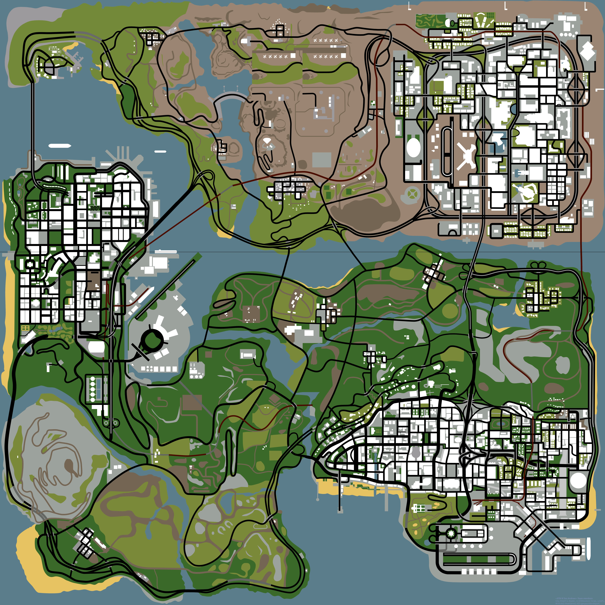

# 🧭 San Andreas GPS Navigator 3D

Sistema web de navegación y cálculo de rutas óptimas y alternativas para **Grand Theft Auto: San Andreas**, impulsado por el algoritmo **A\*** (A-Star), Teoría de Grafos, física de elevación 3D y **Leaflet.js**.



---

## 🚀 Características

* **🗺️ Red Vial Oficial de Rockstar Games:**
  * **28,991 nodos de vehículos** y **59,620 tramos viales** extraídos de los archivos `NODES.DAT` oficiales del juego.
  * Cobertura de todo el estado: Los Santos, San Fierro, Las Venturas, Red County, Flint County, Bone County, Tierra Robada y Whetstone.
* **⚡ Motor de Navegación A\* Ultrarrápido:**
  * Implementación optimizada con `MinHeap` y tabla hash espacial $O(1)$.
  * Trazado de rutas completas de una ciudad a otra en **~100 ms**.
* **🛣️ Rutas Alternativas:**
  * Calcula automáticamente la ruta más rápida y hasta 2 rutas secundarias viables mediante penalización dinámica de aristas.
* **📍 Navegación Multi-Parada:**
  * Soporte para marcar paradas intermedias ilimitadas ($A \to B \to C \to D \dots$).
  * Desglose de distancia y tiempo por cada tramo individual.
* **⛰️ Física Altimétrica 3D:**
  * Distancia euclidiana 3D real $(\Delta X, \Delta Y, \Delta Z)$.
  * Penalización por pendientes pronunciadas (reducción de potencia de motor en subidas y ganancia por inercia en bajadas).
  * Perfil altimétrico con cálculo de subida/bajada acumulada y cota sobre el nivel del mar.
* **🎨 Interfaz Web Interactiva:**
  * Mapa Ultra HD ($6144 \times 6144\text{ px}$) generado a partir de los 144 archivos `.txd` del radar oficial.
  * Marcadores arrastrables (*Drag & Drop*) con recálculo de ruta en tiempo real.
  * Inspector de coordenadas en vivo $(X, Y)$ al mover el cursor.

---

## 🛠️ Estructura del Proyecto

```text
├── index.html              # Interfaz web principal
├── package.json            # Metadatos del proyecto
├── vercel.json             # Configuración para despliegue en Vercel
├── .gitignore              # Archivos excluidos de git
│
├── css/
│   └── style.css           # Estilos modernos con tema oscuro y glassmorphism
│
├── js/
│   ├── map-config.js       # Coordenadas Leaflet L.CRS.Simple y calibración
│   ├── elevation-cost.js   # Módulo independiente de física 3D y pendientes
│   ├── pathfinder.js       # Motor A* con MinHeap y rutas alternativas
│   └── app.js              # Controlador de UI, marcadores y eventos
│
└── data/
    ├── san_andreas_official_nodes.json  # Red completa de San Andreas (28,991 nodos)
    └── san_fierro_official_nodes.json   # Subconjunto de San Fierro (6,217 nodos)
```

---

## 💻 Ejecución Local

Para probar localmente con cualquier servidor estático:

```bash
# Con Python
python3 -m http.server 8080

# O con Node.js
npx serve .
```

Abre en tu navegador: `http://localhost:8080`

---

## 🌐 Despliegue en Vercel

```bash
npx vercel
```

---

## 📜 Licencia

MIT License. Datos del mapa y radar originales de Rockstar Games.
